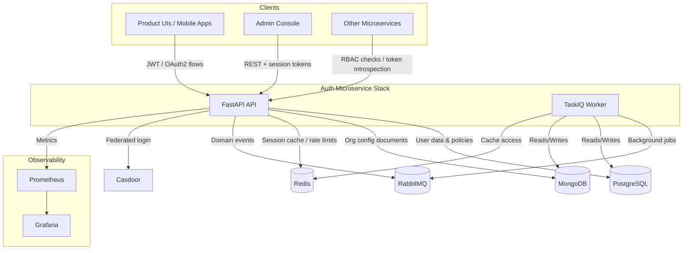

# auth_microservice

Polyglot persistence FastAPI service that powers authentication, Google SSO, and fine-grained RBAC policy enforcement for the OneOrg platform. The service combines:

- **PostgreSQL** for transactional user, billing, and RBAC data.
- **MongoDB** for organization specific configuration documents.
- **pycasbin** to evaluate role/permission policies stored in Postgres.
- **Casdoor** (Google SSO) integration for federated login flows.

## Features

- FastAPI-based REST API with JWT authentication and Google SSO via Casdoor.
- Polyglot persistence: PostgreSQL for transactional data, MongoDB for organization settings.
- Alembic migrations including seeded RBAC roles/permissions.
- RBAC enforcement using pycasbin with policies pulled from Postgres (Redis-backed decision cache).
- CLI + API bootstrap flows that create the platform superuser and seed Casbin policies (`auth-microservice createsuperuser`).
- Taskiq worker for background jobs with RabbitMQ and Redis integration (password reset tokens, feature flags, rate limits).
- Domain events emitted to RabbitMQ for audit, security, email, and log ingestion pipelines.
- Prometheus metrics endpoint and pre-configured Grafana dashboards.

## Architecture

High-level layout of the runtime stack and integration points used to deliver authentication and RBAC across the platform.



## REST API

### Monitoring & Utilities
- `GET /health` – Legacy health probe (same payload as `/healthz`).
- `GET /healthz` – Liveness probe.
- `GET /readyz` – Readiness probe (verifies database connectivity).
- `GET /version` – Report the running build’s semantic version.
- `GET /docs`, `GET /swagger-redirect`, `GET /redoc` – Interactive OpenAPI documentation UIs.
- `POST /echo/` – Returns the posted payload (integration testing helper).
- `GET /redis/?key=` – Fetch a value from Redis using the diagnostic connection (dev/test only).
- `PUT /redis/` – Upsert a key/value pair in Redis via the diagnostic endpoint (dev/test only).
- `POST /rabbit/` – Publish a plaintext message to a RabbitMQ exchange (dev/test only).
- `POST /internal/reindex` – Rebuild search/FTS indexes (`X-Internal-Secret` required).
- `POST /internal/cache/invalidate` – Flush RBAC caches (`X-Internal-Secret` required).

### Authentication (`/auth`)
- `POST /auth/register` – Register a user and seed their RBAC membership.
- `POST /auth/login` – Issue a legacy JWT access token for username/password pairs.
- `GET /auth/sso/google/login` – Initiate Google SSO via Casdoor (returns login URL & state).
- `POST /auth/sso/google/callback` – Finalize the legacy Google SSO flow and mint a JWT.

### Versioned Authentication (`/v1/auth`)
- `POST /v1/auth/login` – Authenticate + create a session (records IP/user-agent metadata).
- `POST /v1/auth/logout` – Revoke the caller’s active session (`get_current_principal`).
- `POST /v1/auth/refresh` – Exchange a refresh token for a new access token pair.
- `POST /v1/auth/password/forgot` – Generate a password reset token for the supplied email.
- `POST /v1/auth/password/reset` – Complete password reset using the issued token.
- `GET /v1/auth/me` – Return the authenticated user profile.
- `GET /v1/auth/providers` – List enabled SSO providers (currently Google).
- `GET /v1/auth/sso/callback` – Exchange the Casdoor auth code and issue session tokens.
- `POST /v1/auth/sso/link` – Attach a Google SSO identity to the current user.
- `DELETE /v1/auth/sso/link` – Remove the linked Google SSO identity for the current user.

### Tenant Bootstrap
- `POST /v1/bootstrap/organization` – Provision the first organization + admin (shared secret protected).

#### Platform superuser CLI

Provision the platform-wide root administrator once per environment right after migrations complete:

1. Run the migrations inside Docker so the schema and seed data exist:
   ```bash
   docker compose run --rm migrator
   ```
2. Launch the admin CLI in an ephemeral API container. You can omit `--password` to be prompted securely:
   ```bash
   docker compose run --rm api auth-microservice createsuperuser \
     --username root-admin \
     --email root@example.com \
     --first-name Root \
     --last-name Admin
   ```
3. If the stack is already running, swap in `docker compose exec api` to reuse the live container; in CI/CD add `--password` plus `--no-input` so the command stays non-interactive.

The command idempotently creates the `RootOrg`, assigns the `super_admin` role, seeds the default permissions, and reloads Casbin policies if they were already present.

#### Bootstrap security

- Set `BOOTSTRAP_SECRET` (or `AUTH_MICROSERVICE_BOOTSTRAP_SECRET`) before starting the API; requests must include `X-Bootstrap-Secret`.
- The endpoint auto-falls back to the platform bootstrap path when no organizations exist, ensuring a deterministic tenancy starting point.

### Billing
- `GET /v1/billing/plans` – List all billing plans (`billing.plan.read`).
- `POST /v1/billing/plans` – Create a billing plan (`billing.plan.write`).
- `PATCH /v1/billing/plans/{plan_id}` – Update billing plan attributes (`billing.plan.write`).
- `GET /v1/orgs/{organization_id}/subscription` – Inspect an organization’s subscription (`billing.subscription.read`).
- `POST /v1/orgs/{organization_id}/subscription` – Create a subscription for an organization (`billing.subscription.write`).
- `PATCH /v1/orgs/{organization_id}/subscription` – Update subscription dates/details (`billing.subscription.write`).
- `GET /v1/orgs/{organization_id}/invoices` – List invoices for an organization (`billing.invoice.read`).
- `GET /v1/invoices/{invoice_id}` – Fetch a specific invoice (`billing.invoice.read`).
- `PATCH /v1/invoices/{invoice_id}` – Update invoice metadata (`billing.invoice.write`).

### Support Tickets
- `POST /v1/support/tickets` – Create a support ticket for the current user (`support.ticket.create`).
- `GET /v1/support/tickets` – List tickets scoped to the caller’s organization (`support.ticket.read`).
- `GET /v1/support/tickets/{ticket_id}` – Retrieve a ticket + requester details (`support.ticket.read`).
- `PATCH /v1/support/tickets/{ticket_id}` – Update ticket status/fields (`support.ticket.update`).
- `POST /v1/support/tickets/{ticket_id}/comments` – Add an internal/external comment (`support.comment`).
- `GET /v1/support/tickets/{ticket_id}/comments` – List comments on a ticket (`support.ticket.read`).

### Organizations
- `POST /v1/orgs` – Create an organization (`org.create`).
- `GET /v1/orgs` – Enumerate organizations (`org.read`).
- `GET /v1/orgs/{organization_id}` – Fetch organization metadata (`org.read`).
- `PATCH /v1/orgs/{organization_id}` – Update organization name/licensing (`org.update`).
- `DELETE /v1/orgs/{organization_id}` – Deactivate an organization (`org.delete`).
- `POST /v1/orgs/{organization_id}/admins` – Create an admin user + role assignment (`user.invite`, `role.assign`).
- `GET /v1/orgs/{organization_id}/settings` – Fetch document-store backed settings (`settings.read`).
- `PUT /v1/orgs/{organization_id}/settings` – Upsert organization settings (`settings.update`).
- `GET /v1/orgs/{organization_id}/privacy` – Fetch privacy preferences (`privacy.read`).
- `PUT /v1/orgs/{organization_id}/privacy` – Upsert privacy preferences (`privacy.update`).

### Users
- `POST /v1/orgs/{organization_id}/users` – Invite a user into an organization (`user.invite`).
- `GET /v1/orgs/{organization_id}/users` – List organization users with optional status filter (`user.read`).
- `GET /v1/users/{user_id}` – Retrieve a single user (`user.read`).
- `PATCH /v1/users/{user_id}` – Update profile fields/role (`user.update`).
- `DELETE /v1/users/{user_id}` – Deactivate a user (`user.delete`).
- `GET /v1/users/{user_id}/contact` – Retrieve contact details (`user.read`).
- `PATCH /v1/users/{user_id}/contact` – Upsert contact details (`user.update`).

### RBAC
- `POST /rbac/check` – Evaluate a permission for a user/org tuple.
- `GET /rbac/users/{user_id}/permissions` – List effective permissions for a user within an organization.
- `GET /v1/rbac/roles` – List roles in the caller’s organization (`role.read`).
- `POST /v1/rbac/roles` – Create a new role (`role.create`).
- `PATCH /v1/rbac/roles/{role_id}` – Update role metadata (`role.update`).
- `DELETE /v1/rbac/roles/{role_id}` – Remove a role (`role.delete`).
- `GET /v1/rbac/permissions` – Enumerate global permissions (`perm.read`).
- `POST /v1/rbac/permissions` – Create a permission (`perm.create`).
- `POST /v1/rbac/roles/{role_id}/permissions` – Attach a permission to a role (`role.perm.assign`).
- `DELETE /v1/rbac/roles/{role_id}/permissions/{permission_id}` – Detach a permission (`role.perm.revoke`).
- `POST /v1/rbac/users/{user_id}/roles` – Assign a role to a user (`role.assign`).
- `DELETE /v1/rbac/users/{user_id}/roles/{role_id}` – Revoke a role from a user (`role.revoke`).
- `GET /v1/rbac/effective/{user_id}` – Compute a user’s effective permissions (`role.read`).

### Feedback & Search
- `POST /v1/feedback` – Submit feedback (document store backed) (`feedback.create`).
- `GET /v1/feedback` – List feedback for an organization (`feedback.read`).
- `PATCH /v1/feedback/{feedback_id}` – Update feedback status/content (`feedback.update`).
- `GET /v1/search` – Perform an organization-scoped search across indexed documents (`search.read`).

### Security & Activity
- `GET /v1/security/alerts` – List security alerts (`security.alert.read`).
- `PATCH /v1/security/alerts/{alert_id}` – Update alert status/metadata (`security.alert.update`).
- `GET /v1/activity/logins` – Audit login attempts (`activity.login.read`).
- `GET /v1/activity/users` – Audit user activity entries (`activity.user.read`).
- `GET /v1/audit/logs` – Retrieve change audit log entries (`audit.log.read`).

### Settings
- `GET /settings/organization/{organization_id}` – Retrieve organization settings from Mongo.
- `GET /settings/organization/{organization_id}/privacy` – Retrieve privacy settings from Mongo.
- `GET /settings/organization/{organization_id}/feedback` – Retrieve aggregated feedback data.

## Quick start with Docker Compose

1. Copy the provided `.env` and adjust secrets as needed (JWT, Casdoor credentials, etc.).
2. Build images and pull dependencies:
   ```bash
   docker compose build
   ```
3. Apply the database schema and RBAC seed data:
   ```bash
   docker compose run --rm migrator
   ```
4. Bring up the API, worker, and monitoring stack (Prometheus & Grafana):
   ```bash
   docker compose up -d api taskiq-worker prometheus grafana
   ```
5. Tail logs or inspect health:
   ```bash
   docker compose logs -f api
   ```
6. Open the interactive docs at [http://localhost:8000/api/docs](http://localhost:8000/api/docs).

> **Tip:** `docker compose down -v` tears down the stack and removes persisted Postgres/Mongo volumes.

## Developer tooling

### Environment files
- `.env.example` contains a minimal set of secrets/connection strings required to run the stack locally.
- `make env` will copy the example file to `.env` if one is not already present.
- Update `BOOTSTRAP_SECRET`, `METRICS_INGEST_SECRET`, and `INTERNAL_API_SECRET` before exposing the service outside of a development environment.

### Make targets

| Command            | Description |
|--------------------|-------------|
| `make install`     | Install Poetry dependencies. |
| `make lint`        | Run Ruff lint checks. |
| `make format`      | Apply Black formatting and Ruff autofixes. |
| `make typecheck`   | Execute mypy against `auth_microservice` and tests. |
| `make test`        | Run the full pytest suite. |
| `make check`       | Convenience target for lint + typecheck + tests. |
| `make migrate`     | Apply Alembic migrations. |
| `make run`         | Start the FastAPI application via `python -m auth_microservice`. |
| `make superuser`   | Invoke the CLI bootstrap command (set `USERNAME`, `EMAIL`, `FIRST`, `LAST`, optional `PASSWORD`). |

### Continuous integration

GitHub Actions workflow `.github/workflows/ci.yml` runs on pushes and pull requests against `main`. The pipeline:
- Configures Python 3.12 with Poetry.
- Starts Postgres, Redis, RabbitMQ, and MongoDB service containers for integration tests.
- Copies `.env.example` into place, installs dependencies, then executes `make lint`, `make typecheck`, and `make test`.

### Services started by the compose stack

| Service            | Container name                | Purpose                                    |
|--------------------|-------------------------------|--------------------------------------------|
| `api`              | `auth_microservice`           | FastAPI application serving REST endpoints |
| `taskiq-worker`    | `auth_microservice-worker`    | Background worker for Taskiq jobs          |
| `db`               | `auth_microservice-db`        | PostgreSQL 16 with application schema      |
| `mongo`            | `auth_microservice-mongo`     | MongoDB 6 for organization documents       |
| `redis`            | `auth_microservice-redis`     | Redis cache / Taskiq backend               |
| `rmq`              | `auth_microservice-rmq`       | RabbitMQ broker                            |
| `prometheus`       | `auth_microservice-prometheus`| Metrics collection (/metrics scrape)       |
| `grafana`          | `auth_microservice-grafana`   | Pre-provisioned Prometheus datasource      |

### Observability dashboards

- Prometheus UI: [http://localhost:9090](http://localhost:9090)
- Grafana UI: [http://localhost:3000](http://localhost:3000) (default credentials `admin` / `admin`).

Grafana automatically discovers the Prometheus datasource configured in `deploy/grafana/provisioning/datasources/datasource.yml`. Import any preferred FastAPI dashboards or create custom panels using the `Prometheus` datasource.

### Metrics endpoint

- Prometheus scrapes metrics from `GET /metrics/prometheus` (already configured in the bundled Prometheus).
- Metrics ingestion endpoints (all require the shared `X-Internal-Secret` header or `METRICS_INGEST_SECRET`):
  - `POST /metrics/system-health` → writes to `system_health_logs`.
  - `POST /metrics/system-alerts` → writes to `system_alerts`.
  - `POST /metrics/usage` → writes to `usage_metrics`.
- Update `deploy/prometheus/prometheus.yml` if you change the API port or add additional scrape targets.

### Redis & RabbitMQ responsibilities

- **Redis**
  - RBAC decision cache (`rbac:decision:*`) with short TTLs for repeat permission checks.
  - Password reset tokens (`password_reset:token:*`, `password_reset:user:*`) and per-user rate limits (`password_reset:rate:*`).
  - Feature flag storage (`feature_flags:{organization_id}`) consumed by `/v1/flags`.
- **RabbitMQ exchanges** (see `auth_microservice/services/events.py`)
  - `security.events` – security & auth lifecycle events (e.g., `auth.login`, `password.reset`).
  - `audit.events` – administrative audit trail emissions.
  - `email.events` – transactional email payloads such as password reset notifications.
  - `logs.ingest` – high-volume log forwarding towards TSDB/warehouse sinks.

Each exchange is declared on demand; queues/workers can bind to routing keys to react asynchronously.

### Admin panel APIs

Administrative helpers exposed under `/admin` (all require `X-Internal-Secret`):

- `GET /admin/orgs/{orgId}/overview` – aggregate counts, latest invoices, and recent login buckets.
- `GET /admin/rbac/snapshot/{orgId}` – roles, permissions, and user assignments snapshot.
- `POST /admin/bootstrap/seed` – rebuild default roles/permissions for every org (disabled in production).

### Prebuilt dashboards

- Grafana auto-loads the `Auth Microservice Overview` dashboard from `deploy/grafana/dashboards/auth_microservice_overview.json`.
- The dashboard appears under the *General* folder—duplicate it before customizing to keep the JSON source intact.

### Alerting rules

- Prometheus evaluates alert definitions in `deploy/prometheus/alerts.yml` (API down, high error rate, high latency).
- Extend the Prometheus configuration to wire these alerts into Alertmanager, Slack, PagerDuty, etc.
- After editing dashboards or alert rules, refresh the monitoring services:
  ```bash
  docker compose up -d prometheus grafana
  ```


## Environment variables

All configuration is driven through the `.env` file (autoloaded by docker-compose). Key variables:

| Variable | Description |
| --- | --- |
| `AUTH_MICROSERVICE_DB_*` | PostgreSQL connection details used by the API and migrator. |
| `AUTH_MICROSERVICE_MONGODB_URI` / `AUTH_MICROSERVICE_MONGODB_DATABASE` | Connection target for the Mongo document store. |
| `AUTH_MICROSERVICE_JWT_SECRET_KEY` / `USERS_SECRET` | Secrets for issuing/validating access tokens. Change for production. |
| `AUTH_MICROSERVICE_CASDOOR_*` | Casdoor endpoint and client credentials for Google SSO. |
| `GRAFANA_ADMIN_USER` / `GRAFANA_ADMIN_PASSWORD` | Override Grafana's admin credentials (defaults to `admin`/`admin`). |
| `AUTH_MICROSERVICE_METRICS_INGEST_SECRET` | Shared secret required for `/api/metrics/*` POST ingestion endpoints. |
| `AUTH_MICROSERVICE_INTERNAL_API_SECRET` | Shared secret required for `/api/admin/*` and `/internal/*` maintenance endpoints. |

Update these values before deploying to any shared environment. Casdoor itself is not part of this compose stack—you must supply credentials for your hosted Casdoor instance.

## Database migrations

Migrations are handled with Alembic. Typical workflows:

- **Apply migrations (already done in the quick start):** `docker compose run --rm migrator`
- **Create a new migration after model changes:**
  ```bash
  docker compose run --rm api alembic revision --autogenerate -m "describe change"
  docker compose run --rm migrator
  ```

## Local development without Docker

Poetry remains available for direct execution:

```bash
poetry install
poetry run python -m auth_microservice
```

You will need equivalent Postgres, Mongo, Redis, and RabbitMQ instances available locally and the `.env` updated to point to them.

## Testing

Run the test suite inside Docker:

```bash
docker compose run --rm api pytest -vv
```

Or locally after installing dependencies with Poetry:

```bash
pytest -vv
```

Key integration suites now cover:
- Redis-backed RBAC caching, feature flags, and password reset token workflows.
- RabbitMQ event publishing for security/audit/email flows.
- Bootstrap safeguards (CLI + API) for the initial superuser/organization.

---

For additional project details (logging, task queues, etc.), explore the source under `auth_microservice/` or review configuration in `settings.py`.
